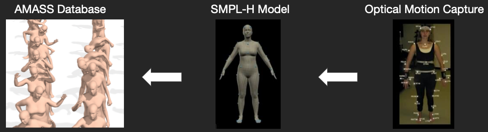
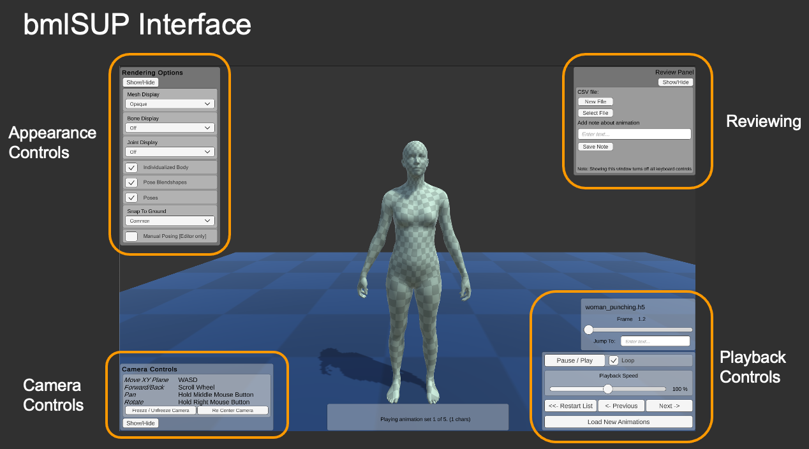

## Realistic body model animations - SMPL, MoSh, and AMASS

Virtual characters are used in a wide range of on-screen applications and immersive and collaborative environments. Due to the high degree of control of the presentation and animation of the characters they lend themselves well to research on biological motion and person perception. However, historically, virtual characters suffered from unrealistic deformations at joints. Recent advances in computer graphics and statistical body models of human bodies have led to increasingly realistic virtual characters [\[1\]](https://smpl.is.tue.mpg.de)[\[2\]](https://smpl-x.is.tue.mpg.de)[\[3\]](https://mano.is.tue.mpg.de).

One such advancement is the MoSh [\[4\]](http://mosh.is.tue.mpg.de). MoSh reconstructs motion and shape from optical motion capture markers and produces an animated 3D mesh using the statistical body model SMPL [\[1\]](https://smpl.is.tue.mpg.de)[\[5\]](https://amass.is.tue.mpg.de). SMPL is a data-driven model. It parametrizes the inter-individual variance in body shape through a series of parameter weights, and also provides a set of pose-dependent blendshapes that improve the realism of the mesh deformations when the joints move. These pose-dependent blendshapes result in large improvements over linear blend skinning, which causes unrealistic mesh deformations at joints. These features allow the SMPL model to create realistic individualized and animated meshes.

[AMASS](https://amass.is.tue.mpg.de) is a large database of such animated body models [\[5\]](https://amass.is.tue.mpg.de). This database currently unifies 18 different marker-based motion capture datasets using the [MoSh++](http://mosh.is.tue.mpg.de) method and the [SMPL-H](https://mano.is.tue.mpg.de) model that also contains hand poses [\[3\]](https://mano.is.tue.mpg.de)[\[4\]](http://mosh.is.tue.mpg.de). The animations are stored as animated SMPL-H parameters and include a wide variety of everyday actions and sports movements.



Currently, animations from AMASS are easily rendered only in python. With the growing popularity and power of real-time 3D rendering tools, including popular game engines, more options are needed for displaying realistic virtual humans in 3D environments. Here, we present a tool, called bmlSUP, for rendering AMASS animations in the Unity Game Engine. The tool contains an implementation of the SMPL-H model using Unity's native blendshapes and animation system Mecanim. This tool allows access to the large amount of animations provided in the AMASS dataset, and an interface to easily load them into Unity.

## The BioMotionLab SMPL Unity Player

The bmlSUP player can only be used for non-commercial purposes, and falls under the same license agreement as AMASS and SMPL.

### Accessing and loading AMASS animations:
Animations from the AMASS database can be downloaded [Here](https://amass.is.tue.mpg.de). The animations are stored in ```.npz ``` format, which can only be accessed in python. To play the animations in Unity, the files must be converted into a C# readable file format. We provide a python tool to convert into ```.json``` files with some example scripts. For more information on conversion click [here](documentation/Converting.md).

Each frame in an AMASS animation includes the SMPL-H parameters for that frame: body pose (including hand articulations), global body translation, and DMPL dynamic soft-tissue coefficients [\[3\]](https://mano.is.tue.mpg.de). The animation file also contains the individualized body shape parameters of the female or male SMPL-H model. Our player currently does not support DMPL. AMASS animations containing such data will still play, but the current version of our player will exclude these components. The player is structured in a modular fashion. Body shape parameters, skeleton pose, and pose-dependent blendshapes can be individually toggled and substituted.

Animation files can be loaded individually or in batch as a folder with subfolders. If a batch of animations should be played in a specific order, a ```.txt``` file must be included specifying the order. Multiple or paired animations can be played simultaneously by explicitly including them as a sequence in the ```.txt``` file.

### Playback

There are two ways to play animations. Via a [graphical user interface (GUI)](documentation/gui/guiloading.md), or via scripting using a [simple c# API](documentation/api/apiloading.md).

#### GUI

The included graphical user interface can be accessed by installing the package Samples in the package manager. After opening the scene, and pressing play, a loading screen appears where animation files can be loaded. We have included a few samples.

Once playing, the main playback interface appears:



The interface includes the following controls:
* Playback Controls
    * Play/Pause, Playback Speed, "Scrubber",
    * Navigation buttons (Next/Previous animation, etc.)
* Appearance Controls
    * Toggle between mesh rendering: opaque with checkerboard texture, semi-transparent, or no mesh.
    * Toggle bones
    * Toggle joints
* Camera Controls:
    * Runtime camera repositioning, similar to Editor Scene View. 
* Reviewing
    * Save ```.txt ``` notes about animations while viewing them.
    * Useful for annotating large sets of animations.
* Many more advance customizations

Learn more [Here](documentation/gui/guiloading.md).

#### C# API

We have included a simple API for loading, playing, and controlling playback options. This option is useful for more complex applications such as integrating bmlSUP into an existing project, or for more advanced customizations.

The API is designed to be as simple as possible. The following is an example of a complete working script that plays the first animation from a loaded set.

```c#
public class AnimationManager : MonoBehaviour {
    
    [SerializeField] AnimationListAsset animationListAsset = default;
    [SerializeField] PlaybackSettings playbackSettings = default;
    [SerializeField] BodyOptions bodyOptions;
    [SerializeField] DisplaySettings displaySettings;
    
    List<List<AMASSAnimation>> animations;
    AMASSAnimationPlayer player;
    
    void OnEnable() {
        AnimationLoader.LoadFromAnimationListAssetAsync(animationListAsset, DoneLoading);
        player = new AMASSAnimationPlayer(playbackSettings, displaySettings, bodyOptions);
    }

    void DoneLoading(List<List<AMASSAnimation>> loadedAnimations) {
        this.animations = loadedAnimations;
        player.Play(animations[0]);
    }

}
```

Learn more [here](documentation/api/apiloading.md).

## Acknowledgements
We wish to thank Nima Ghorbani and Naureen Mahmood for their useful comments and providing an early prototype of the Unity Player and the basis for the skinned meshes. This work was supported by CFREF VISTA funding.