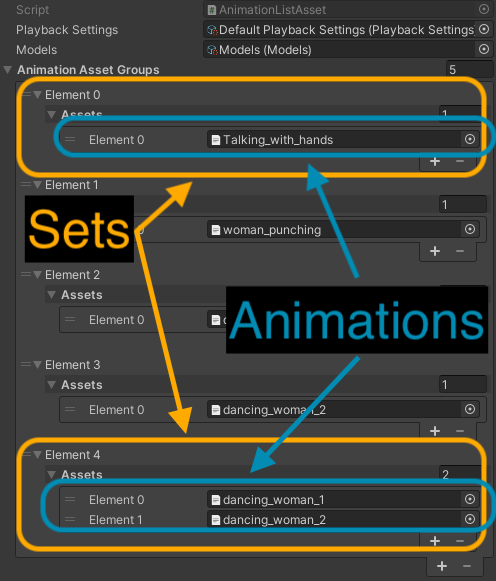

Using the c# scripting api, bmlSUP can easily load AMASS animations inside your own scripts and projects.

### Defining an animation list

The easiest way to load animations is by first creating an AnimationList Asset, and then dragging animation files to it in the inspector. 

1. Create the asset by right clicking on your Assets folder, select Create > bmlSUP > New AnimationList Asset.
2. The asset will appear in your Assets folder. Click it.
3. In its inspector you can add new entries, then drag the animation .json files into place.

The structure of the asset might be confusing at first. There are lists within lists. This is to allow animations to be grouped into sets that play simultaneously. This is essential for paired motion capture such as two people dancing.

In the assets inspector, you can add entries first to create new sets, then inside each set, create new entries for each animation.

The following image shows a sample. There are 5 animation sets. The final set contains two paired animations, which are of two women dancing together. This paired set was recorded from simultaneous motion capture of two people.



The list asset requires references to default playback settings and models to load from. These should already be populated, and can be overwritten later.

Once the list asset has been created, calling methods from the ```SUPLoader``` class will load these animations into memory. 

```c#
SUPLoader.LoadFromListAssetAsync(animationListAsset, DoneLoading);
```

This function takes a reference to the animation List Asset, as well as a function (```DoneLoading```) to run when it is done loading.

Passing a function as an argument is common with asynchronous programming. This is an advanced topic, but in a nutshell, this enables your program to continue running while it's loading, then calls the function when complete to allow you to continue your setup. This prevents hangs and freezes to the user while loading.

The ```DoneLoading``` method needs to take a list of animation sets as a parameter, so that the program can pass the loaded result back to you. like so:

```c#
void DoneLoading(List<List<AMASSAnimation>> loadedAnimations) {
    this.animations = loadedAnimations;
}
```

All this method does is store the loaded animations in a field. Later on you can iterate through this list and play each one. See the [playback section](apiplayback.md) for a complete working example.


### Loading directly from the file system

Loading via an AnimationList asset is by far the easiest and least error-prone way to load animations, advanced users can also load via the file system.

It works in a similar way, except that you have to first create an ```AnimationFileReference``` object. This must be passed a valid path to a folder on your hard drive containing animations.  

By default it will play all animations individually in the specified folder. However, users can optionally pass a path to a ``.txt`` file that contains a list of ordered and grouped animations to play. For more information on creating these text files see [this page](../gui/guiloading.md)

```c#
// File reference to all animations in a folder and its subfolders.
AnimationFileReference fileReference = new AnimationFileReference(animationsFolder);

// File reference to animations in a folder to be ordered and grouped into sets according to the listFile.
AnimationFileReference fileReference = new AnimationFileReference(animationsFolder, listFile);

```

Once a file reference has been created we can load the animations into memory. We need to define a Models object and a Playback settings to make sure the loader loads the proper models and playback settings. These can be set via the unity inspector via ```[SerializedFields]``` Use the default objects unless you know what you're doing.

```c#
SUPLoader.LoadAsync(fileReference, models, playbackSettings, DoneLoading);
```

Similar to above we also need to pass it a ```DoneLoading``` method that fires when loading is complete.


