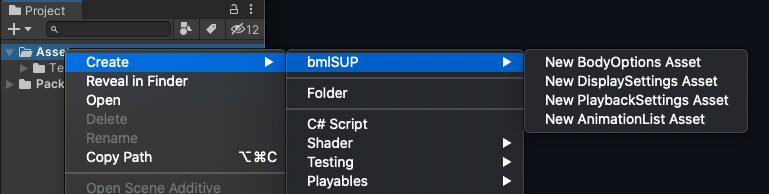

To customize settings, bmlSUP needs to be provided with overrides for the default settings. The settings are defined using settings assets.

To create custom settings, create the assets from the asset creation menus. These are created like any other asset, by right clicking in the Project view and selecting them. There should be a bmlSUP submenu that shows where they can be created.

