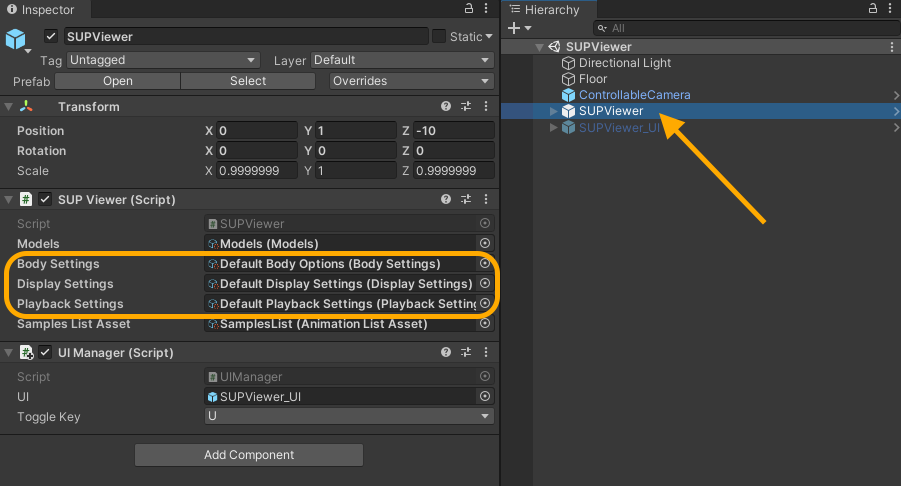

To customize settings, bmlSUP needs to be provided with overrides for the default settings. The settings are defined using settings assets.

To create custom settings, create the assets from the asset creation menus. These are created like any other asset, by right clicking in the Project view and selecting them. There should be a bmlSUP submenu that shows where they can be created.


 

One these Assets have been created, you can supply them to the bmlSUP player. 

## GUI Viewer

Click on the SUPViewer GameObject in the SupViewer sample Scene. In the inspector, drag your new settings assets into the appropriate fields.



## C# Scripting API

When creating a new player object, you must supply settings files as parameters. 

```text
SUPPLayer player = new SUPPLayer(playbackSettings, displaySettings, bodySettings);
```

Here is an example Monobehaviour using custom settings

```c#
public class AnimationManager : MonoBehaviour {
    
    [SerializeField] AnimationListAsset animationListAsset = default;
    
    //Modify these in the inspector with the newly created custom settings assets
    [SerializeField] PlaybackSettings playbackSettings = default;
    [SerializeField] BodySettings bodySettings = default;
    [SerializeField] DisplaySettings displaySettings = default;
    
    List<List<AMASSAnimation>> animations;
    SUPPlayer player;
    
    void OnEnable() {
        AnimationLoader.LoadFromListAssetAsync(animationListAsset, DoneLoading);
        
        // This is where the settings are applied
        player = new SUPPlayer(playbackSettings, displaySettings, bodySettings);
    }

    void DoneLoading(List<List<AMASSAnimation>> loadedAnimations) {
        this.animations = loadedAnimations;
        player.Play(animations[0]);
    }

}

```


You can also supply custom settings to individual animations when playing them. This allows playing animations with many different settings applied at runtime.

```c#
// override all settings
player.Play(animations[0], myCustomDisplaySettings, myCustomPlaybackSettings, myCustomBodySettings);

// or override only one at a time
player.Play(animations[0], myCustomPlaybackSettings);
```