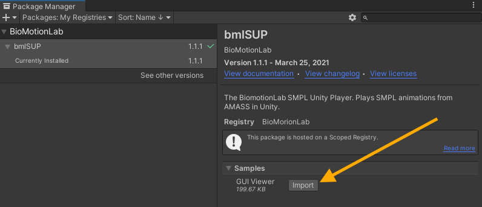
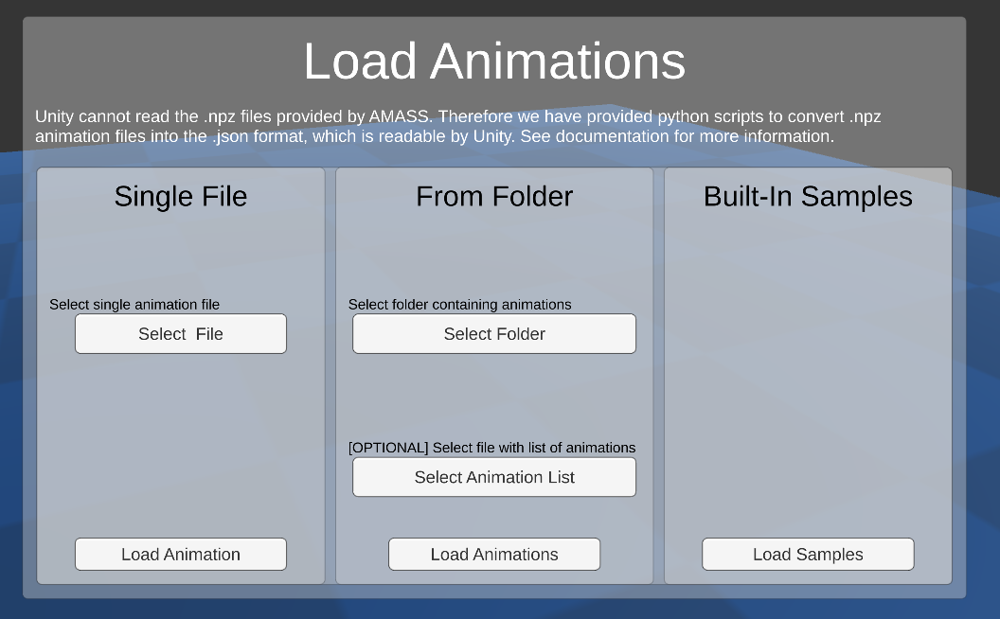

## Open GUI Viewer Sample

To access the GUI Scene, you need to install the sample scene into your project. Go to the Package manager, choose bmlSUP, then click the Samples dropdown, and import the GUI Viewer scene.



This will create a new folder in your assets folder with the sample scene in it. Double click the scene to open it.

## Loading WIndow

When running the GUI Viewer Scene, you are immediately presented with a loading window.



This window provides several options for loading files.

Only ```.json``` files from the python conversion scripts are supported.

### Load Samples

We have provided a few samples for testing purposes. Clicking this buttom will load them and demonstrate the basic functionality of the bmlSUP GUI Viewer.

### Single File

Load a single animation file for viewing. 

### From Folder

This  loads an entire sequence of animations from a folder. Once loaded, users can navigate between the animations using the playback controls. 

By default, the animations are played back one-by-one in alphabetical order. 

##### Optional list file
However, an optional list ```.txt``` file can be supplied to specify the order and to pair animations together. 

The list file should follow the following format:
* Each line is a grouped set, that is played together simultaneously.
* Animations on the same line should be separated by a space, and have the full file name including extension.
* No blank lines, and watch for spelling mistakes.
* Animations sets are played from the top to the bottom
* The list file paths assume you have selected the base folder.

Simple Example:
```text
animation3.json
animation1.json
animation2.json
```

Example that plays multiple animations together by entering them on the same line separated by a space.
```text
animation1A.json animation1B.json
animation2A.json animation2B.json
```

You can also specify files inside subfolders:
```text
Set1/animationA.json Set1/animationB.json
Set2/animationA.json Set2/animationB.json
```