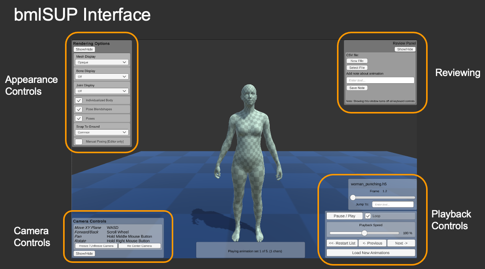
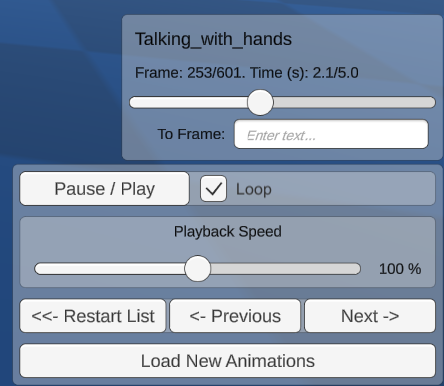
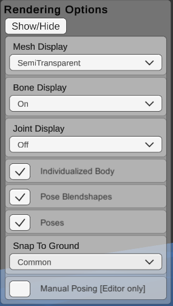
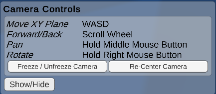
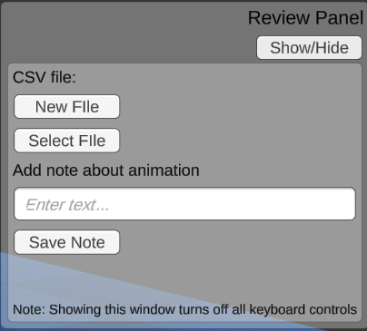

When after loading animations, the main playback screen shows, and the first animation begins playing. There are several controls that can be modified at runtime. 

Note that changes made during runtime do not save between sessions. To modify the default options permanently, the settings files must be adjusted in the editor.



The entire GUI can be toggled on and off by pressing the ```u``` key. This is useful for screen capturing or for an unobstructed view of the scene.

In several instances below, custom settings assets are mentioned. Please read [this page](../customsettings.md) for more infornmation on customizing settings files.

## Playback Controls



### "Scrubber"

* One scrubber shows up for each currently playing animation.
* Shows the current frame, total frames, current time, total duration, and controls to jump to a particular frame or time.

### Playback

* Controls to pause / play, and adjust the playback speed
* Loop currently can only be adjusted outside playmode using a custom PlaybackSettings asset.

Backwards playback can be enabled by creating a custom PlaybackSettings asset.

### Navigation

Navigate between loaded animations, or reopen the loading window


## Appearance Controls



### Mesh Display:

* Opaque: An opaque mesh is rendered with the default texture. This texture can be modified in the editor.
* Semi-Transparent: A semi-transparent mesh is rendered so that the outline of the body is visible while allowing joints and bones to also be visible.
* No Mesh: Mesh rendering is turned off

Mesh display options can be further customized in the editor by creating and editing a new DisplayOptions asset.

### Bone Display

* A display of lines for bones of the SMPL Model can be toggled on and off. These lines connect joints together. They do not match real skeletal bones.

Bone display options can be further customized in the editor by creating and editing a new DisplayOptions asset. The size and coloring can be adjusted.

### Joint Display

* A display of spheres for the joints of the SMPL Model can be toggled on and off. They do not match real skeletal joints.

Joint display options can be further customized in the editor by creating and editing a new DisplayOptions asset. The size and coloring can be adjusted.

### SMPL component checkboxes

* Individualized Body: This toggles between using the individualized body shape weights (betas), or using the average body shape.
* Pose Blendshapes: This toggles whether to add the pose-dependent blenshape corrections to the mesh. When off, it uses only default linear blendskinning, which produces more artifacts during movement, especially at elbows and knees.
* Poses: This toggles whether to use the pose information in the animation file. When off, a T-Pose is maintained.

### Grounding

These options affect whether to correct for errors in the motion capture ground plane.

* Common: A corrected ground plane is calculated for the first animation only, and this correction is applied to all animations this session.
* Individual: A corrected ground plane is calculated and applied to each animation separately.
* None: No Corrections are done, the values from the motion capture are trusted.
* Custom Value: You can enter an offset for each character in the scene view of the unity editor. (Does not work in compiled projects)

### Manual Posing

Bone rotations and positions can be adjusted manually via their transforms in the Unity Editor Scene view. 

This is useful for putting bodies in specific poses, or for examining how the SMPL model works.

The pose-dependent blendshapes can still be enabled. This is great for examining the effects of the pose-dependent blendshapes of the SMPL model.

Does not work in compiled projects.

## Camera Controls



The main camera controls are similar to the unity editor scene view controls. 

* Freeze/Unfreeze: This lock the camera in its current position, so it cannot be changed by accident.
* Recenter: Return the camera to its initial position at the start of the program. This initial position can be adjusted by editing the camera's transform component in the scene view outside playmode.

## Reviewing Controls



The review controls enable simple annotation of animation sets, via adding lines to a CSV file. This is useful for loading a large set of animations and making quick notes about them while viewing them. 

* New file: Create a new notes file on your computer.
* Select file: Append to an existing notes file.

Once a file is created or selected, type a note in the text field, and hit Save Note, to add a line to the file with the animation name and your note.

Note that when this window is showing, all other keyboard controls are disabled.
