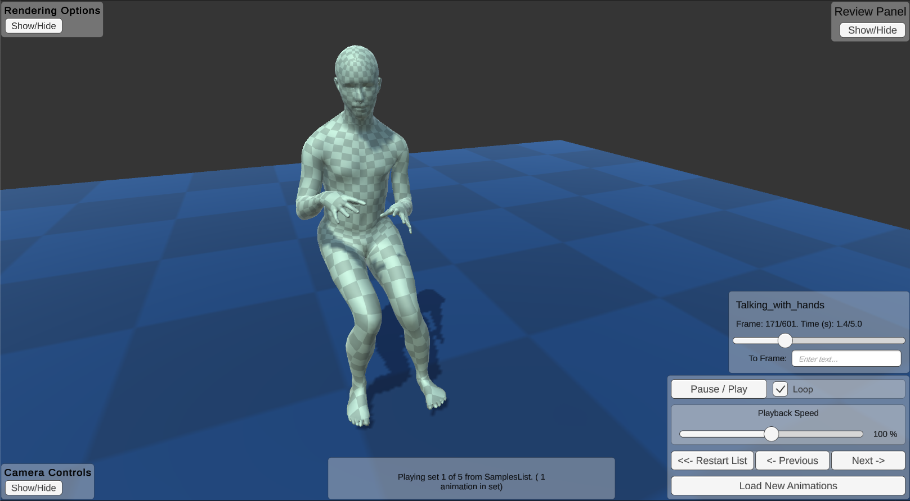
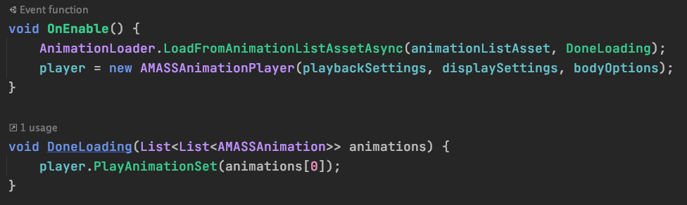

There are two ways to play animations: Via a graphical user interface (GUI), or via scripting using a simple c# API.

## GUI Viewer

The GUI is the fastest and easiest to use, but not as flexible as the scripting API. 

The GUI is suitable for projects that require viewing a set of animations in sequence, and would like to control the playback of the animations during runtime.

Possible uses:
1. As a starting point for more complex gui-based projects
2. To review animations or test them out.
3. As an exploratory tool.

See the GUI section of the documentation for more information.

## C# Scripting API

The C# scripting API takes a bit more time to get going, and currently does not provide out-of-the-box runtime controls.

The scripting API is suitable for projects that want to precisely control when and how animations are presented. Fine-tuned control of the animation options is more difficult, but more customization is possible.

Possible uses:
1. For projects require more precise control and timing
2. For precisely controlled behavioural experiments
3. For projects requiring high customization.